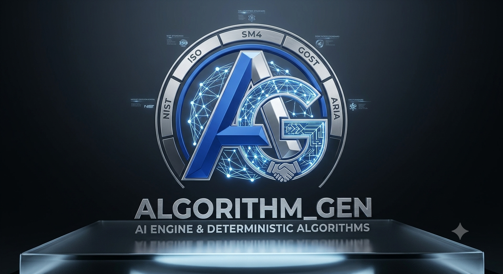

## Algorithm_Gen
<p align="center">
  
</p>

### Core systems and Programming Languages


### Cybersecurity & Offensive Auditing


### Low-Level Infrastructure & Performance


### DevOps, Infrastructure & Build Tools


### Platform Support & Hardware Architecture


### Cloud Providers


### Artificial Intelligence & Quantum


### Client Frameworks


## What is this about?

It is a hybrid AI-driven algorithm generation engine that outputs highly efficient Python code. It acts as an orchestration pipeline that takes user prompts (in any language), translates them to English, and routes them through a decision matrix. If a user requests standard cryptographic algorithms (like AES, China's SM4, or Russia's GOST), it bypasses the AI to return a deterministic, hardcoded blueprint. For novel requests, it uses the OpenAI API to generate custom algorithms, running them through a local sandbox and formatting optimizer.

### Why this is cool?

* **Polyglot Performance:** It leverages Python for API orchestration and LLM integration, while utilizing a Rust backend (`src/lib.rs` compiled via PyO3) to handle high-speed mathematical validations and intensive cryptographic cipher iterations.
* **Automated Data Sovereignty:** The engine is highly aware of geopolitical data regulations. The `generator/cloud/sovereignty.py` module automatically maps algorithms to specific cloud deployment regions (e.g., enforcing `cn-northwest-1` for SM4 or completely air-gapping GOST deployments) to maintain strict compliance. 
* **Built-in Threat Mitigation:** It includes a `sandbox.py` utility that routes all AI-generated code into an isolated environment and captures standard output, preventing malicious or poorly optimized AI code from executing directly on the host machine.

* **Post-Quantum Readiness:** The template architecture includes scaffolding for Post-Quantum cryptographic blueprints like CRYSTALS-Kyber, highlighting a forward-looking design.

### What problems this solves?

1.  **AI Cryptographic Hallucinations:** By catching requests for standard encryption and routing them to deterministic blueprints (`national_standards.py`), it solves the critical issue of LLMs confidently generating flawed or non-standard cryptographic implementations.

2.  **Deployment Compliance:** It eliminates the risk of accidentally deploying regionally-restricted algorithmic logic onto non-compliant cloud infrastructure (AWS/GCP).

3.  **Language Barriers:** The deep-translator integration allows global teams to request complex algorithms in their native language while enforcing English standard variable naming and documentation in the final output.

### How to install this?

You have two primary paths based on the `Dockerfile` and `Makefile`:

**Method 1: Docker (Recommended)**

The repository includes a Dockerfile that handles all the heavy lifting, including pulling the Rust toolchain.

1. Clone the repository.
2. Build the image:
   ```bash
   docker build -t algorithm_gen .
   ```

**Method 2: Local Installation**

1. Ensure Python 3.10+ and the Rust toolchain (`cargo` and `rustc`) are installed on your system.
2. Clone the repository.
3. Use the provided Makefile to install dependencies:
   ```bash
   make install
   ```
   *(This executes `pip install -r requirements.txt`)*
4. The Rust extensions will be compiled dynamically upon execution, or you can build them manually if needed.

### How to use this?
1. Create a `.env` file in the root directory. Based on the `.env` template shown, you must provide your API keys:
   ```env
   OPENAI_API_KEY=your_openai_api_key_here
   # Add AWS/GCP keys if testing the cloud deployment routing
   ```
2. Run the main CLI loop (either locally or via your Docker container):
   ```bash
   python run.py
   ```
3. The terminal will greet you with "Welcome to the AI Algorithm Generator!".
4. Enter your prompt (e.g., "Generate a standard SM4 encryption algorithm" or "Write an optimized pathfinding algorithm").
5. The system will output the processed code, display recommended cloud sovereignty regions, and wait for your next command. Type `exit` or `quit` to close the loop.
